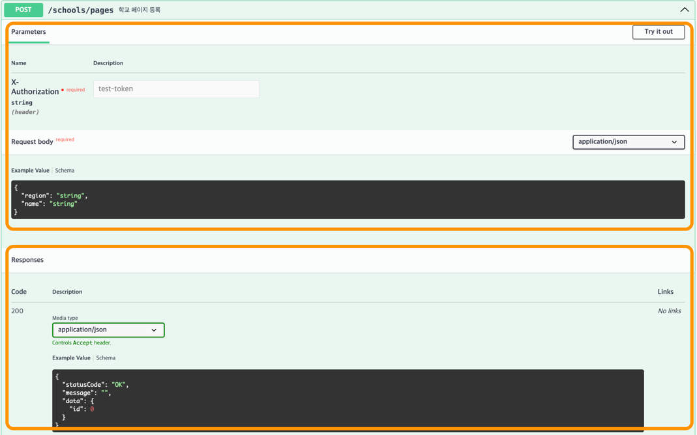
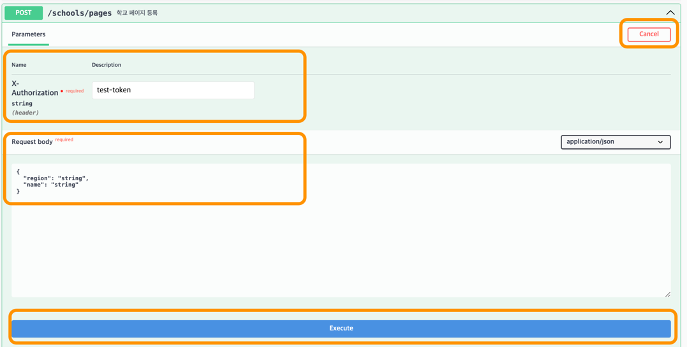
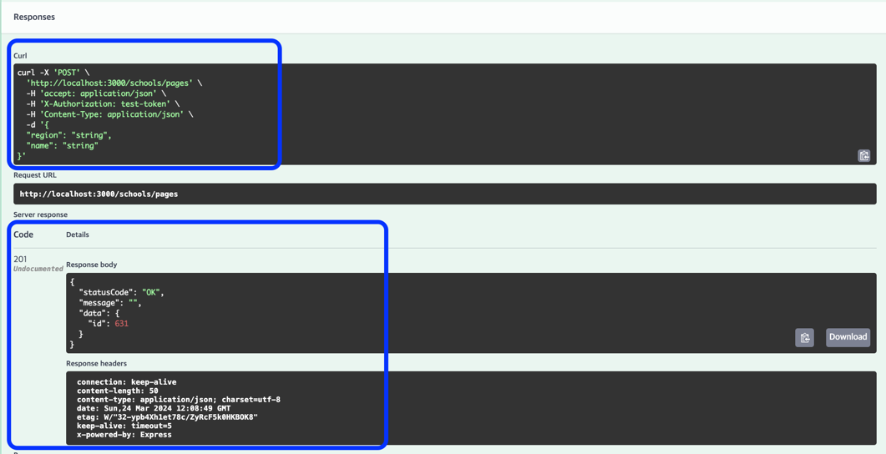

# 구동방법

1. Docker Compose 실행

로컬환경 애플리케이션과 연동할 mysql 컨테이너를 실행합니다.

```shell
docker compose up --build -d
```

2. 연동테스트

앱과 mysql의 정상 연동 상태를 테스트합니다.

```shell
npm run test:local
```


3. 앱 실행

모든 테스트가 완료되면 다음 명령어를 입력해 앱을 실행해주세요. 

```shell
npm run start:external:local
```

4. api docs 접속

API 요청/응답 스키마를 확인하고, API 호출을 테스트할 수 있습니다.

```shell
http://localhost:3000/docs
```

<br>

# 확인 절차

학교관리자 인증 Guard와 학생사용자 인증 Guard가 구현되어 있습니다.

헤더의 `x-authorization` 값에 임의의 문자열(ex. `test-token`)을 입력하면 <br> 
school_id=1인 학교관리자 또는 student_id=1인 학생사용자로 API를 이용할 수 있습니다.

앱 구동이 완료되면 API Docs (http://localhost:3000/docs) 로 이동해 API 호출을 테스트할 수 있습니다.

### 요청 / 응답 구성


API의 요청 파라미터와 응답 데이터의 스키마를 확인할 수 있습니다.

### API 호출 테스트





테스트하는 API의 우측 상단에서 `Try it out`을 누르고, 필요한 파라미터를 입력한 후, 하단의 `Excute`를 누르면 <br>
실제 전송되는 요청의 curl과 응답 결과를 확인할 수 있습니다.

### 테스트 커버리지

테스트는 직렬로 수행되어야 정상적으로 실행되기 때문에 <br>
테스트 커버러지 측정 시 `--runInBand` 을 활성해줘야 합니다.

```shell
jest --runInBand --coverage
```